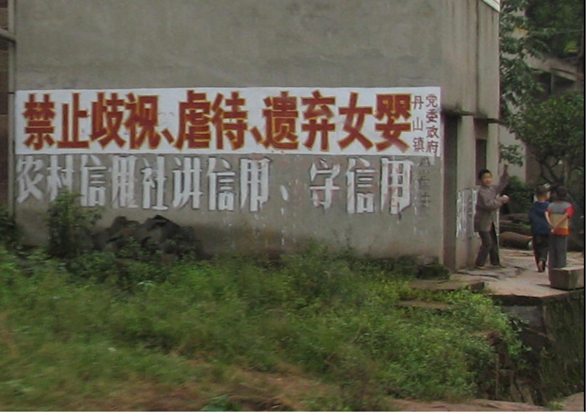

## "After sterilization": Women's Reproductive Bodies


{% include images/juxtapose.html
  image1="images/Picture1.png"
  image2="images/Picture2.png"
  starting-position="35%"
  caption="Drag the slider to see two similar documentary scenes."
%}


The left photo, titled *After Sterilization* (《结扎之后》), was shot by a Chinese photographer Jialin Wu in 1991, at a township health center in Xuanwei, Yunnan Province in China. In this picture, we can see a husband carrying his wife—who has just completed the surgery and has not yet recovered her strength—high on his back using a bamboo basket, hurriedly leaving the health center. Around them, other farmers are gathered in front of the clinic door, either squatting or standing with complex expressions, perhaps also waiting for their wives to finish the surgery and come out. Coincidentally, another photographer, Dengke Hou, also captured a similar scene during the family planning policy period (The Right Photo). 

These documentary images reproduce a scene of Chinese rural women gathered and having undergone sterilization surgeries during the high-pressure era of the family planning policy in the late 20th century. They not only record the bodily trauma of rural women during that high-pressure era, but also provide a unique visual window through which to observe how state policy embedded itself into microscopic individual lives.

While these documentary images capture their silent pain, existing scholarship on the family planning policy predominantly operates within grand narratives. Under this globally scrutinized population policy, women are frequently reduced to mere statistical aggregates, neglected, or muted—leaving their own voices entirely unheard. Therefore, this research aims to move beyond these overarching state narratives, penetrating into the granular recesses of individual lives to unearth the lived experiences and reproductive bodies of women, particularly those from rural areas, who stood at the very center of this storm. Adopting a reproductive justice framework, this study seeks to critically reinterrogate the broader family-planning regime, as epitomized by the one-child policy.


```yaml
 ✦ ✦ ✦
```


## Part one: Family-planning policy: A brief history


This essay also has `autoscroll: true` in the page header--you may have noticed a little popup in the lower right of your screen--which enables a hands-free scrolling mode useful for demos and recordings. Anywhere on the page, press **P** to start auto-scrolling; press **P** again to pause. Scrolling manually, pressing **Escape**, or using arrow keys also pauses it.

Auto-scroll is off by default on all pages. To enable it, add `autoscroll: true` to a page's metadat. Remove the line (or set it to `false`) to disable it.


## All the Basics Still Work

Forest doesn't replace Seedling or Sapling—it **includes** them. You can mix simple images, footnotes, and section headings with the advanced features we're about to show you.

The key to Forest essays is knowing when to use which tool. Not every moment needs a cinematic treatment. Sometimes a simple image alongside text is exactly right.

{% include images/figure-wrap.html
  image-position="right"
  image-width="48%"
  caption="Ferns on the forest floor. Simple figure-wrap, right-aligned at 48%."
  image-path="images/ferns-closeup.jpg"
  text=firstimage
%}


## TBD
Text:



{% assign forest_captions =
"Strengthen technical guidance and extensively publicize the scientific knowledge of birth control." Zhao Surong, a doctor from the Tingliuhe Working Committee Hospital, goes into the fields to educate the masses on the scientific knowledge of family planning.|
Barefoot doctors served as the primary grassroots backbone for carrying out technical guidance on family planning. Leveraging the barefoot doctors' close ties with and deep understanding of the masses, Laoting County actively publicized the great significance of family planning and effectively managed its technical guidance work. This is barefoot doctor Zhou Jinghua, going deep into commune members' homes and sitting on their kang (heated brick bed-stoves) to promote the benefits of family planning and deliver contraceptives directly to the commune members." | split: '|'
%}

{% include images/carousel.html
  id="forest-carousel"
  width="85%"
  class="center"
  images=forest_images
  headers=forest_headers
  captions=forest_captions
%}


```yaml
 ✦ ✦ ✦
```


## Part two: Re-evaluating the population policy


As a female who was born and raised in a small city in China, I have often heard people around me mention in everyday conversations that the implementation of the one-child policy, at the very least, fostered greater gender equality. Their reasoning is that the strictly enforced policy forced many to abandon traditional gender biases and son preference, leading them to value daughters instead. 

However, does this represent the full picture? How can we objectively, reasonably, and fairly evaluate the overall consequences and lasting impacts (especially the gender equality aspect) of family planning—particularly the one-child policy—in contemporary China? 


<p align="middle">
  
<p align="middle" style="font-size: 0.9em; color: #666; max-width: 600px;">
  A promotional slogan painted on a wall by local authorities, reading: "Prohibit the discrimination, abuse, and abandonment of female infants."
</p>


### Having a Second Child? Exceptions Under the High-Pressure One-Child Policy


#### 1.	The disabled firstborn exception

Although the family planning policy was strictly implemented during the 1980s, certain exceptions still existed. One was when the firstborn was disabled—Policy documents explicitly stipulated that when the first child was a disabled child, approval could be granted to have a second child. 

To this end, the Administrative Measures for the Medical Identification of Disabled Children was promulgated. Under these measures, family planning administrative departments at the provincial and municipal levels (with districts) established expert panels for the medical identification of disabled children. Relevant professionals holding titles of associate senior level or above in the medical field were recruited to review application materials for disabled children (including those with congenital or acquired illnesses, or disabilities resulting from accidental injuries) and to make professional medical identifications.

Childbearing thus became a “quota” that required individuals to apply upward through administrative channels, and was only permitted after official review and approval.


#### 2.	The  “One-and-a-half-child policy”


As discussed above, during the period of 1980–1984, the government adopted an extremely strict one-child policy. However, policymakers underestimated the intense desire for sons within traditional patriarchal families, especially in rural areas. Thus, the draconian one-child policy brought immense panic and resistance to the peasantry. Many rural couples, after having a daughter, would even leave their hometowns and flee to other places, thereby evading inspections by family planning officials, just to have a son. In the 1990s, a highly famous sketch comedy titled “The Above-Quota Birth Guerrillas” (Chaosheng Youjidui) served as an artistic reflection of this social phenomenon.

In light of this, the government issued Document No. 7 on April 13, 1984, titled “Report on the Situation of Family Planning,” which laid down the following regulation: 


{% include typography/pullquote.html
  box-align="center"
  width="70%"
  text="In rural areas, there is an urgent need to open the loophole slightly wider in a controlled manner; upon approval, a second child may be allowed."
%}


<p>In fact, we can see that this so-called “one-and-a-half-child” policy was a response by the government to the resistance of the peasantry, who were driven by traditional and rooted gender preference. It represented a partial compromise and concession. Consequently, the emergence of such a semi-policy actually resulted in the following consequence: the state, in a disguised form, recognized that the value of a girl is far inferior to that of a boy, and therefore another must be born to make up for it. This policy influence, acting as a psychological suggestive guidance, has actually deepened the concept of preferring sons over daughters. The policy itself has a gender orientation; the policy is not gender-neutral.

<div style="clear:both;display:block;width:100%;height:1px;"></div>


---


### Son preference and its long-term effect:


#### “Zhao Di”, the Culture of Naming Daughters
  
  Many women, especially those from older generations, have names containing the character “Di” (娣), such as Pan Di (盼娣) and Zhao Di (招娣). Structurally, the character “Di” is composed of two radicals: “Nü” (女, meaning woman/daughter) and “Di” (弟, meaning younger brother). Thus, these two names respectively signify “hoping the next child will be a younger brother” and “beckoning a younger brother.” 


{% include scrollybox/bg.html
  height="300vh"
  image-path="images/di.png"
  above-box-space="30vh"
  below-box-space="30vh"
  box-align="right"
  box-content="Media outlets have also reported real-life cases, such as a family that gave birth to nine consecutive daughters over twenty years, all named with variations of “Di”. This reality is also mirrored in literary and cinematic works. For instance, in Big Breasts and Wide Hips (Fengru Feitun)—a masterpiece by the renowned Chinese author Yan Mo—a mother names her seven daughters Lai Di (来娣, “bringing a brother”), Zhao Di (招娣, also “bringing a brother”), Ling Di (领娣, “leading a brother”), Xiang Di (想娣, “thinking of a brother”), Pan Di (盼娣, “looking for a brother”), Nian Di (念娣, “missing a brother”), and Qiu Di (求娣, “begging for a brother”)—a sequence that vividly portrays her deepening obsession with having a son. 

  Furthermore, precisely because Chinese characters are ideographic, anyone encountering these women’s names can immediately discern their parents' intense desire and obsession for a son, as well as the marginalized, disempowered status of these women within their own families."
%}


## Sticky Background

The **sticky background** is similar to a scrollybox but uses CSS `position: sticky` instead of `background-attachment: fixed`. The visual effect is subtly different — the image scrolls *with* you until it reaches the top of the viewport, then sticks while content continues past it.

{% include scrollybox/bg-sticky.html
  image-path="images/misty-forest.jpg"
  height="100vh"
  above-box-space="50vh"
  below-box-space="80vh"
  box-align="right"
  box-content="
**Sticky background with right-aligned text box.**

This component works like the scrollybox from Sapling, but uses a different CSS technique. The image feels more grounded — it moves with the page before locking into place.

Use `bg-sticky` when:
- You want the image to arrive with the scroll rather than being revealed behind content
- You need more reliable behavior on mobile devices
- The sticky \"lock-in\" moment adds to your narrative
"
%}


## Background Switching: Multiple Images
This is what makes Forest essays truly cinematic. You're about to scroll through a section where the background image **switches multiple times** as you read, creating a visual sequence that matches your narrative.

**Watch carefully:** The background starts with one image, then switches to a second, then a third. The text box stays visible throughout.



The first image — a foggy forest scene. This multi-section scrollybox opens with `bg-multi-long.html`, which sets the initial background. Content between here and the `bg-multi-long-close.html` tag appears in a text box that scrolls over the changing backgrounds.

Lorem ipsum dolor sit amet, consectetur adipiscing elit. Phasellus nec ante ligula. Nulla fringilla ligula sit amet nisl consectetur ultricies. Mauris ac tellus eu ante lobortis rhoncus non eu nisl.


### SWITCH: Moss and Bark



The background just switched to moss on a log. Each `bg-switch` tag triggers a new background image when the reader scrolls past it. You can chain as many switches as your narrative needs.

Duis ut dui dolor. Integer eu lectus at tellus accumsan euismod eget a ligula. Morbi venenatis, elit eu varius fermentum, ligula est dictum massa, sit amet ullamcorper augue nisl ut nunc.


### SWITCH: Looking Up



Now the canopy — three layers of the forest shown through three background switches. This technique works for:
- Spatial narratives (moving through a building, landscape, or archive)
- Temporal sequences (before, during, after)
- Evidence building (presenting multiple sources for one argument)
- Scale shifts (close-up → medium → wide)

Duis eros odio, fringilla et pulvinar vitae, eleifend quis elit. Sed eleifend lectus in bibendum elementum. Watch as the text box scrolls out of view, followed by the background fading away.




## Back to Normal Flow
Notice how smoothly you transitioned from that immersive multi-image sequence back to regular essay format? Mixing intense and calm sections creates the rhythm that makes Forest essays compelling.


## Side-Scroll Section

The **side-scroll** component creates a different reading pattern: images appear inline with your text, breaking the vertical flow with full-width visuals.



We begin in the understory. The light here is filtered through layers of leaves above, creating patterns on the forest floor. Every surface harbors life — fungi breaking down fallen wood, mosses covering rocks, insects navigating root systems.

Side-scroll sections alternate between text blocks and full-width images, letting you pace your visual narrative differently from scrollyboxes.



Ferns unfurl from tight spirals called fiddleheads — one of the oldest plant forms on Earth, predating flowering plants by hundreds of millions of years. They thrive in the shade that would starve most other plants.

This is the second text block in the side-scroll section. Each `bg-ss-image` inserts an image and starts a new text block. You can chain as many image-text pairs as you need.



A fallen tree becomes a nurse log — decomposing over decades, feeding the soil, hosting new seedlings on its surface. Nothing in a forest is wasted. The side-scroll pattern works well for this kind of sequential observation: walk, look closely, reflect, walk again.




## What You've Learned in Forest
If you can create a Forest essay, you have mastered:

- **All Seedling components** — Images (figure + figure-wrap), headings, footnotes, pull quotes, block quotes, alert boxes
- **All Sapling components** — Scrollyboxes (bg.html), carousels, jumbotrons, pacing control
- **Advanced Forest features:**
  - Juxtapose interactive comparisons with custom starting position
  - Sticky backgrounds (bg-sticky)
  - Background switching with multiple images (bg-multi-long + bg-switch)
  - Side-scroll sections (bg-ss + bg-ss-image + bg-ss-close)
  - Center-aligned pull quotes and left-aligned blockquotes
  - Header eyebrow, divider, and subtitle fields
  - Auto-scroll for demos

**Between all the essays, you've seen the full Xanthan toolkit.** Not every essay needs every feature, but you now have complete control over how to tell visual stories on the web.

---


## Bibliography

**Primary Source:**

  National Population and Family Planning Commission of the People's Republic of China. “病残儿医学鉴定管理办法” [Administrative Measures for the Medical Appraisal of Sick and Disabled Children]. Decree No. 7, January 18, 2002.<br>

  National Population and Family Planning Commission, ed. 《计划生育规章汇编》 [Compilation of Family Planning Regulations]. Beijing: China Population Publishing House, 1990.<br>

  National Population and Family Planning Commission. 《中国人口和计划生育史》 [History of China's Population and Family Planning]. Beijing: China Population Publishing House, 2007.<br>

  Shenzhen Municipal People's Government. "人口计生委推荐新时期标语口号" [Population and Family Planning Commission Recommends Slogans for the New Era]. August 8, 2007. https://www.sz.gov.cn/cn/xxgk/zfxxgj/tzgg/content/mpost_1613186.html.<br>

  Wang, Qian, and Aihua Xiao, eds. 《中国人口和计划生育年鉴 2008》 [China Population and Family Planning Yearbook 2008]. 1st ed. Beijing: China Population and Family Planning Yearbook Press, 2008.<br>

  Population and Family Planning Office of Dazhong Town, Dafeng City, ed. 《人口与计划生育志，1955–2010》 [Gazetteer of Population and Family Planning, 1955–2010]. N.p., 2011.<br>

  Xiong, Jian. "招娣为什么少了" [Why are there fewer girls named Zhaodi]. People's Daily Overseas Edition, May 18, 2021. https://paper.people.com.cn/rmrbhwb/html/2021-05/18/content_3048979.htm.<br>

  Xinhua News Agency. "陕西安康通报大月份引产调查结果和处理决定" [Ankang, Shaanxi announces investigation results and handling decision on the 'late-term induced abortion']. June 26, 2012. https://web.archive.org/web/20230124091101/http://www.gov.cn/govweb/jrzg/2012-06/26/content_2170557.htm.<br>

  Hou, Dengke. “计划生育突击” [Family Planning Campaign]. 1991. Photograph, Lintong, Shaanxi.<br>

  Wu, Jialin. “结扎之后” [After Sterilization]. 1991. Photograph.<br>

**Secondary Source"**

  Hershatter, Gail. The Gender of Memory: Rural Women and China's Collective Past. Berkeley: University of California Press，2011.<br>

  Hu, Guixiang.《中国计划生育与西村妇女：1950–1980》 [Family Planning in China: Women in Xicun Village: 1950–1980]. Beijing: China Social Sciences Press，2017.<br>

  Mellors Rodriguez, Sarah. Reproductive Realities in Modern China: Birth Control and Abortion, 1911–2021. 1st ed. Cambridge: Cambridge University Press，2023.<br>

  Mo, Mo.《丰乳肥臀》 [Big Breasts and Wide Hips]. Beijing: Writers Publishing House，1995.<br>

  Chen, En. "论独生子女政策的社会起源“ [On the social origins of the one-child policy]. Journal of the Graduate School of Chinese Academy of Social Sciences，2012.<br>
  
  Guangming Daily. "盼得子！20年生9女取名从招娣到求娣“ [Hoping for a son! Giving birth to 9 daughters within 20 years, named from 'Zhaodi' to 'Qiudi']. March 14, 2025. https://guangming.com/